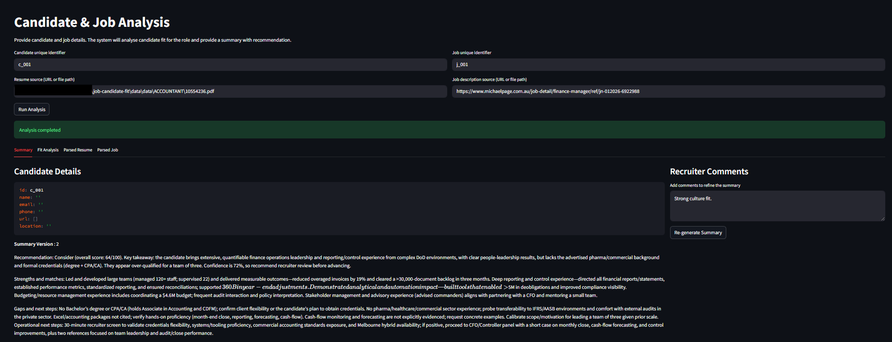
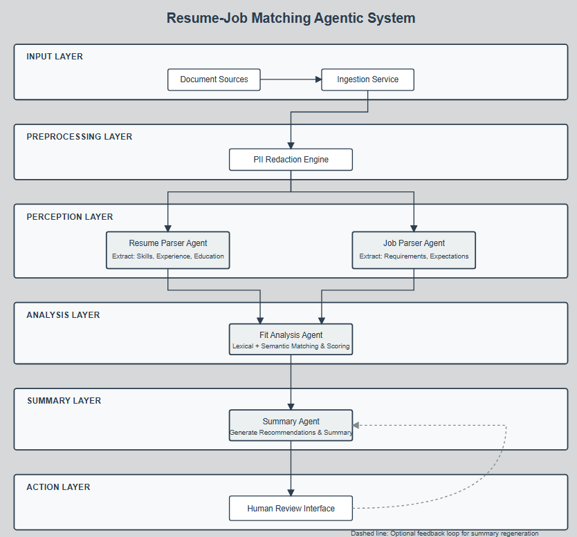

# Candidate–Job Matching & Analysis System

An agentic AI system for analysing candidate–job fit using structured parsing, semantic matching, deterministic scoring, and human-in-the-loop refinement.

Designed for recruiter workflows where key requirements include:
 - explainability
 - auditability
 - human control

---

## Running the Application
### 1. Install

```bash
# Install uv
curl -LsSf https://astral.sh/uv/install.sh | sh

# Clone and setup
git clone <repo>
cd job-candidate-fit
uv sync
```

### 2. Configure

```bash
# Create .env with API keys
cp .env.example .env
# Edit .env and add your keys:
# - OPENAI_API_KEY
# Modify ./src/config.py to change weights and models
```

### 3. Run

```bash
uv run streamlit run app.py
```

Visit `http://localhost:8501`


### 4. Usage

1. Enter Candidate and job identifier
2. Upload resume (or enter URL)
3. Upload job (or enter URL)
4. Click "Run Analysis "
5. View results in "Summary" tab (Explore "Fit Analysis", "Parsed Resume", "Parsed Job" tabs for reference and evidence mapping)
6. Enter recruiter comments if changes need to be made and click "Re-generate Summary" to get modified summary


The following image depicts the UI populated with results


---

## System Architecture

The following diagram shows the high level end-to-end architecture of this system.



### High-level workflow

1. Document Ingestion  
    - Resume and job description loaded from URL or local files.

2. PII Redaction  
    - Sensitive personal information (Name, email, urls, location, phone numbers) removed from resumes before LLM usage.

3. Structured Parsing  
   - Resume parser (LLM) extracts skills, experience, education
   - Job parser (LLM) extracts requirements and expectations

4. Fit Analysis Agent  
   - Lexical + semantic skill matching
   - Deterministic experience and education scoring
   - Seniority assessment
   - Overall fit score and recommendation

5. Summary Agent  
   - Generates recruiter-facing hiring summary
   - Clearly explains strengths, risks, and recommendation

6. Human-in-the-Loop Review  
    - Recruiters add comments and regenerate summaries without recomputing scores.

7. Revised Summary  
    - Updated summary while preserving original analysis for auditability.

---

## Design Principles

- Determinism first  
  Numeric scores are tool-based and reproducible.

- LLMs for reasoning, not math  
  Language models interpret results and never silently recompute metrics.

- Human authority  
  Recruiters influence interpretation, not hidden logic.

- Auditability  
  Original fit analysis is preserved across summary revisions. Exact text snippets from ad and resume are preserved as evidence of LLM claims

---

## Prompt Versioning

Prompts are version-controlled in `src/prompts/v1/`:

```
src/prompts/
├── v1/
│   ├── resume_parser_prompt.txt      # Current resume parser prompt
│   ├── job_parser_prompt.txt         # Current job parser prompt
│   ├── fit_analyser_prompt.txt     # Current matcher prompt
│   └── summariser_prompt.txt     # Current summary prompt
└── v2/                 # Next iteration
    └── ...
```

To iterate on prompts:
1. Copy `v1/` to `v2/`
2. Edit prompts in `v2/`
3. Update agent code to load from `v2/`
4. Test and compare results

---

## Notes

- Summary regeneration does not re-run fit analysis.
- All agent calls are coordinated through the orchestrator.
- The system is designed to be extensible for future re-analysis workflows.
- You can easily swap models by changing the model string in agent definitions.

---

## Dataset Source
- Resumes: 
    - [Dataset](https://www.kaggle.com/datasets/snehaanbhawal/resume-dataset) Download under `./data`
    - [Sample Resumes](https://www.unsw.edu.au/content/dam/pdfs/employability/2023-04-employability/2023-04-employability-resources-resume-guide.pdf)
- Sample Ads:
    - Web links